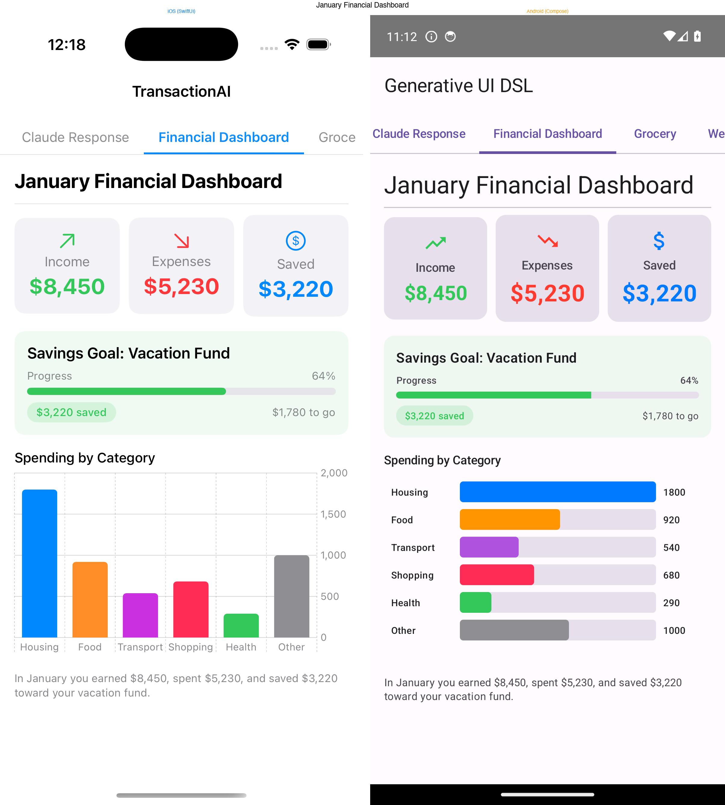
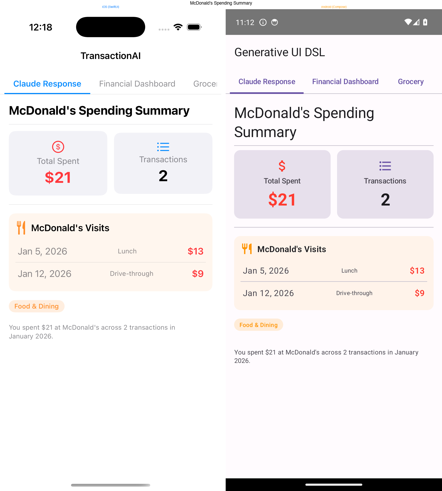
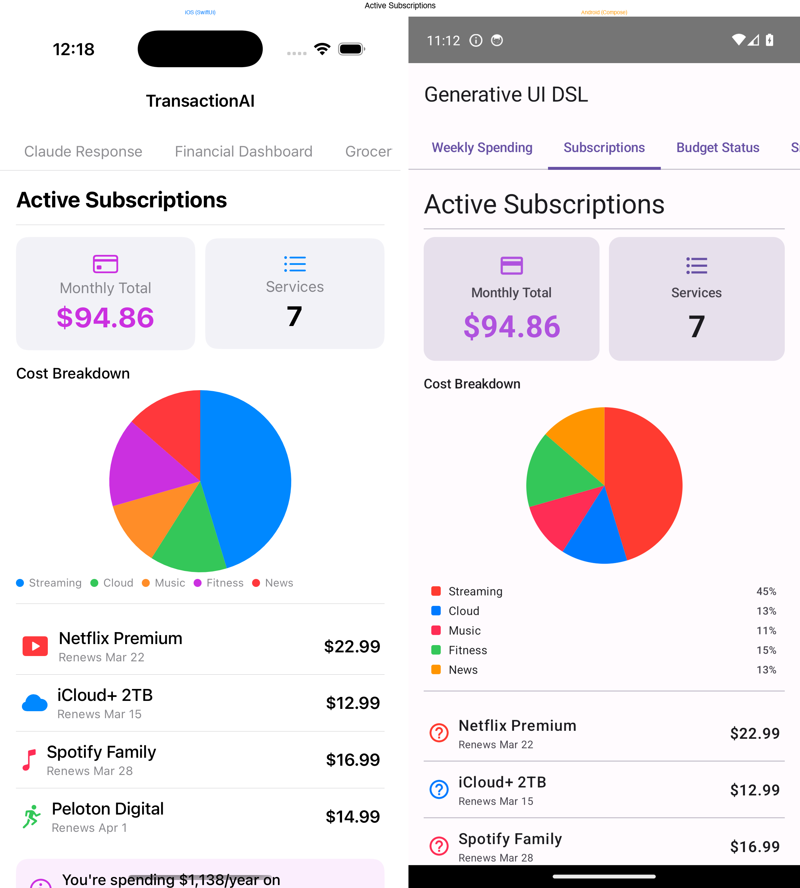
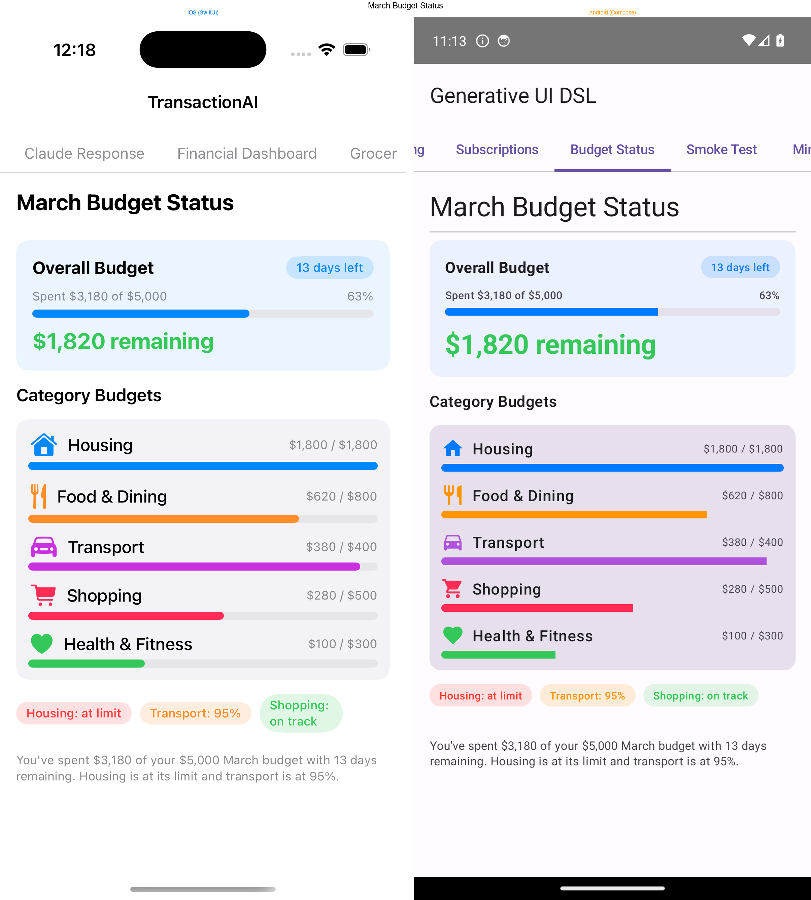

# Generative UI DSL

A cross-platform framework for rendering AI-generated native UI from JSON. Claude (or any LLM) returns a recursive layout tree — the framework walks it and renders real **SwiftUI** or **Jetpack Compose** views. No hardcoded screens.

<p align="center">
  
</p>

## How it works

```
User prompt → LLM → JSON UINode tree → Native renderer (SwiftUI / Compose)
```

The LLM analyses a question, picks the right data, and returns a recursive `UINode` layout tree. The platform-specific renderer walks that tree and produces native views. Both platforms consume the **same JSON format** and produce visually equivalent output.

## Project structure

```
generative-ui/
├── Package.swift                    # Root SPM manifest (for git URL consumption)
├── spec/                            # Shared DSL contract
│   ├── generative-ui-dsl.schema.json
│   ├── icon-map.json
│   ├── test-fixtures/               # 17 JSON test inputs
│   └── test-snapshots/              # Golden render snapshots
├── packages/
│   ├── ios/                         # Swift Package — GenerativeUIDSL
│   │   ├── Sources/GenerativeUIDSL/
│   │   └── Tests/GenerativeUIDSLTests/
│   └── android/                     # Gradle library — com.generativeui:dsl
│       ├── build.gradle.kts
│       └── src/
├── examples/
│   └── android-sample/              # Android demo app (Jetpack Compose)
└── screenshots/                     # Cross-platform comparison images
```

## The DSL

The LLM responds with a `layout` field containing a recursive node tree:

| Category   | Types                                  |
|------------|----------------------------------------|
| Layout     | `vstack`, `hstack`, `zstack`           |
| Content    | `text`, `stat`, `image`, `badge`, `progress` |
| Container  | `card`, `list`                         |
| Data viz   | `chart` (bar, pie, line), `table`      |
| Utility    | `divider`, `spacer`                    |

Example response:

```json
{
  "title": "Food Spending",
  "layout": {
    "type": "vstack",
    "spacing": 12,
    "children": [
      { "type": "stat", "label": "Total", "value": "$214.50", "color": "orange", "icon": "fork.knife" },
      { "type": "chart", "variant": "bar", "title": "By Merchant", "data": [
        { "label": "McDonald's", "value": 54.49, "color": "red" },
        { "label": "Starbucks",  "value": 47.25, "color": "orange" }
      ]}
    ]
  },
  "spoken_summary": "You spent $214.50 on food across 18 transactions."
}
```

## Cross-platform parity

Both renderers produce structurally identical output from the same JSON. This is verified by **render snapshot tests** — a canonical text description of each node tree that must match byte-for-byte across platforms.

<p align="center">
  
  
  
</p>

## Installation

### iOS (Swift Package Manager)

Add to your `Package.swift`:

```swift
dependencies: [
    .package(url: "https://github.com/sameergdogg/generative-ui.git", branch: "main")
]
```

Then import and use:

```swift
import GenerativeUIDSL

let response = try JSONDecoder().decode(UIResponse.self, from: jsonData)
NodeRenderer(node: response.layout)
```

### Android (Gradle)

The library is at `packages/android/`. Add it via composite build or publish to Maven:

```kotlin
// settings.gradle.kts
includeBuild("path/to/generative-ui/packages/android") {
    dependencySubstitution {
        substitute(module("com.generativeui:dsl")).using(project(":"))
    }
}

// app/build.gradle.kts
dependencies {
    implementation("com.generativeui:dsl")
}
```

Then use:

```kotlin
import com.generativeui.dsl.render.NodeRenderer

val response = Json.decodeFromString<UIResponse>(jsonString)
NodeRenderer(response.layout)
```

## Running tests

```bash
# iOS
swift test

# Android
cd packages/android
gradle test
```

## Example apps

- **[Expenses-AI](https://github.com/sameergdogg/Expenses-AI)** — iOS app using Claude to generate expense analysis UI
- **Android sample** — `examples/android-sample/` in this repo
