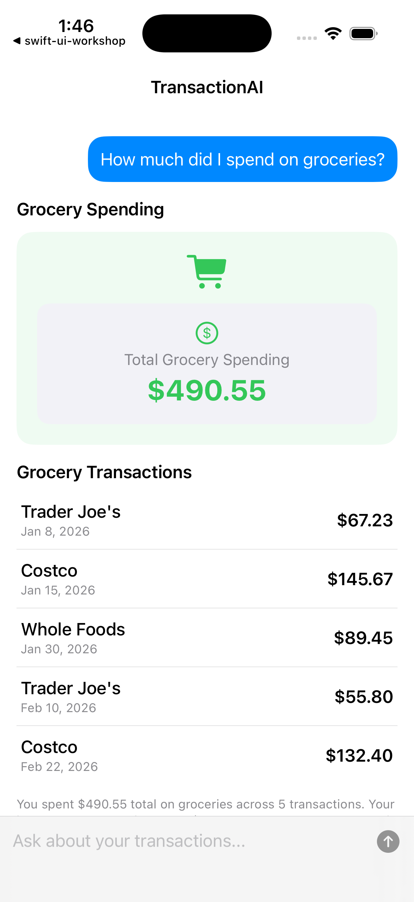

# TransactionAI — Generative UI Prototype

An iOS app that answers natural language questions about your transactions by having Claude generate **native SwiftUI layouts on the fly** — no hardcoded screens.



## How it works

```
User prompt → Claude API → JSON UINode tree → SwiftUI renderer
```

The CSV of transactions is passed directly in the system prompt. Claude analyses the question, picks the right data, and returns a recursive `UINode` layout tree. The app walks that tree and renders real SwiftUI views.

## Demo questions to try

- "How much did I spend this month?"
- "Compare my spending by category"
- "Show me all food & dining transactions"
- "What's my biggest single purchase?"
- "How much did I spend on transportation vs food?"

## Generative UI — the idea

Traditional apps hardcode their screens. A "spending by category" screen is a SwiftUI file written by a developer, showing exactly the views the developer chose. If you want to answer a different question, you write a new screen.

This app takes a different approach: **the UI itself is the AI's output**.

When you ask "how much did I spend on groceries?", Claude doesn't just return a number — it decides *how that answer should look*. It might choose a large stat card if the answer is a single figure, or a list of transactions if you need details, or a bar chart if comparison is useful. It composes those primitives into a layout, encodes it as JSON, and the app renders it. No developer wrote a "grocery spending screen" — Claude composed it at runtime in response to your specific question.

### Why a DSL instead of free-form output

Claude isn't generating SwiftUI code — it's generating data that describes a layout. The app defines a small vocabulary of node types (`stat`, `card`, `chart`, `list`, etc.) and Claude chooses how to combine them. This keeps rendering safe and predictable: the app only ever executes its own SwiftUI code, never anything from the model. The model's creativity is bounded by the DSL; the app's renderer is fully in control.

### The system prompt as a UI contract

The system prompt tells Claude exactly what nodes exist, what properties each accepts, and what good layouts look like. It also instructs Claude to work only from the provided CSV data and to never invent transactions. This makes Claude both a **data analyst** (filtering and aggregating the CSV) and a **UI designer** (picking the right layout for the answer) in a single pass.

## Architecture

### The DSL

Claude responds with a single `layout` field containing a recursive node tree. Available node types:

| Category | Types |
|----------|-------|
| Layout | `vstack`, `hstack`, `zstack` |
| Content | `text`, `stat`, `image`, `badge`, `progress` |
| Container | `card`, `list` |
| Data viz | `chart` (bar or pie) |
| Utility | `divider`, `spacer` |

Example response:
```json
{
  "title": "Food Spending",
  "layout": {
    "type": "vstack",
    "spacing": 12,
    "children": [
      { "type": "stat", "label": "Total", "value": "$214.50", "color": "orange", "icon": "fork.knife" },
      { "type": "chart", "variant": "bar", "title": "By Merchant", "data": [
        { "label": "McDonald's", "value": 54.49, "color": "red" },
        { "label": "Starbucks",  "value": 47.25, "color": "orange" }
      ]}
    ]
  },
  "spoken_summary": "You spent $214.50 on food across 18 transactions."
}
```

### Key files

```
TransactionAI/
├── Models/
│   ├── UINode.swift          # Recursive DSL node types + Codable
│   ├── UIResponse.swift      # Top-level LLM response envelope
│   └── Transaction.swift     # CSV row model
├── Services/
│   ├── ClaudeService.swift   # Claude API call + system prompt
│   └── CSVParser.swift       # Loads transactions.csv
├── Views/
│   ├── ChatView.swift        # Chat UI, message history
│   ├── PromptInputView.swift # Text field + send button
│   └── Components/
│       └── NodeRenderer.swift # Recursively renders UINode → SwiftUI
└── Resources/
    └── transactions.csv
```

## Setup

**Requirements:** Xcode 15+, iOS 17+, an Anthropic API key

1. Clone the repo
2. Copy the secrets file and add your key:
   ```
   cp TransactionAI/Services/Secrets.swift.example TransactionAI/Services/Secrets.swift
   ```
   Then edit `Secrets.swift` and replace `"your-api-key-here"` with your key.
3. Open `TransactionAI.xcodeproj` in Xcode
4. Select a simulator or device and run

> **Note:** `Secrets.swift` is gitignored. Never commit your API key.

## Transaction data

The app ships with a sample `transactions.csv` covering ~30 transactions across categories like Food & Dining, Transportation, Entertainment, and Shopping. You can replace it with your own data — the CSV is passed verbatim to Claude, so keep it under ~100 rows for best performance.

Expected columns: `date`, `merchant`, `category`, `amount`, `payment_method`, `notes`
