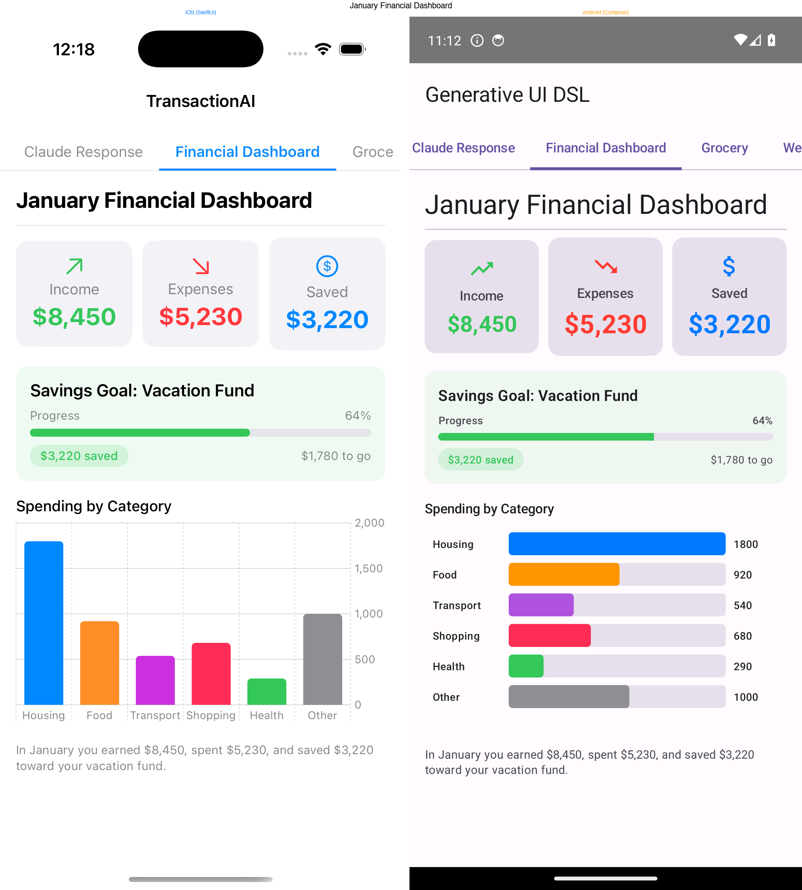
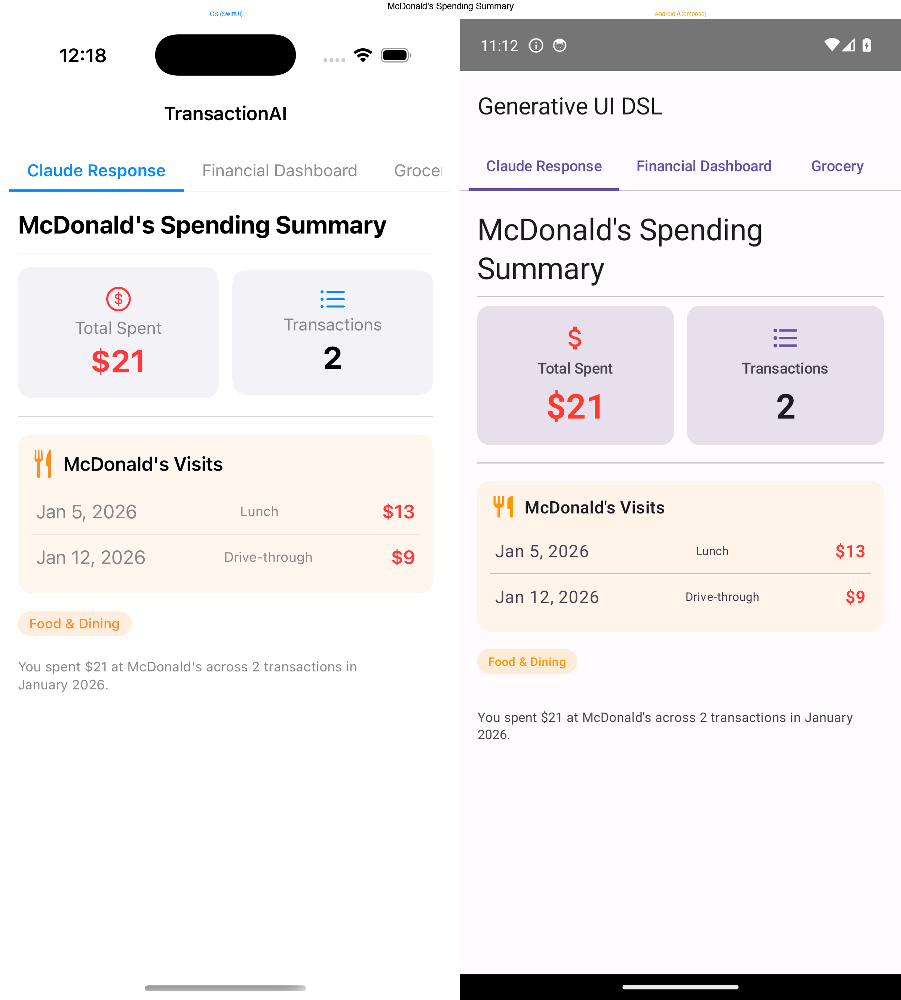
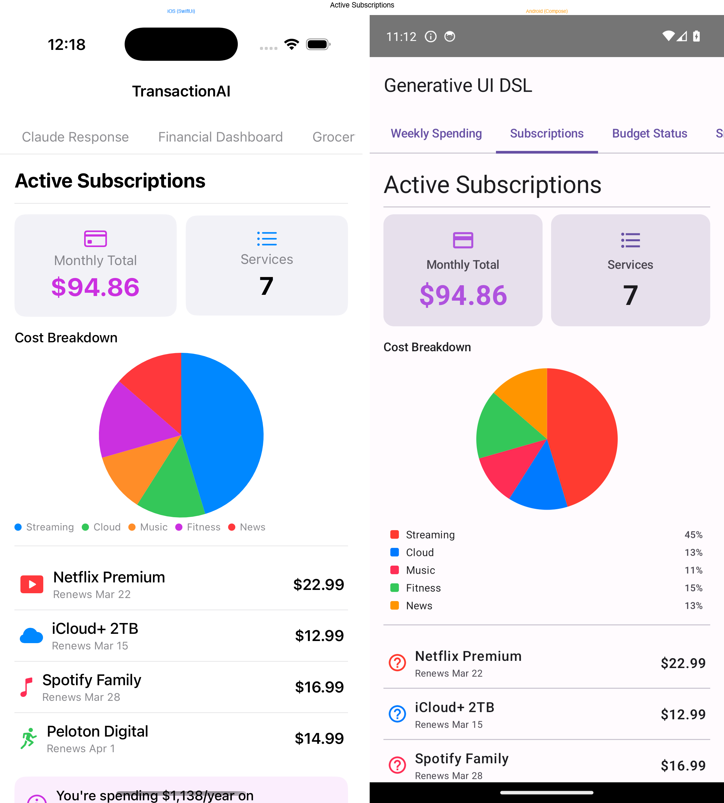
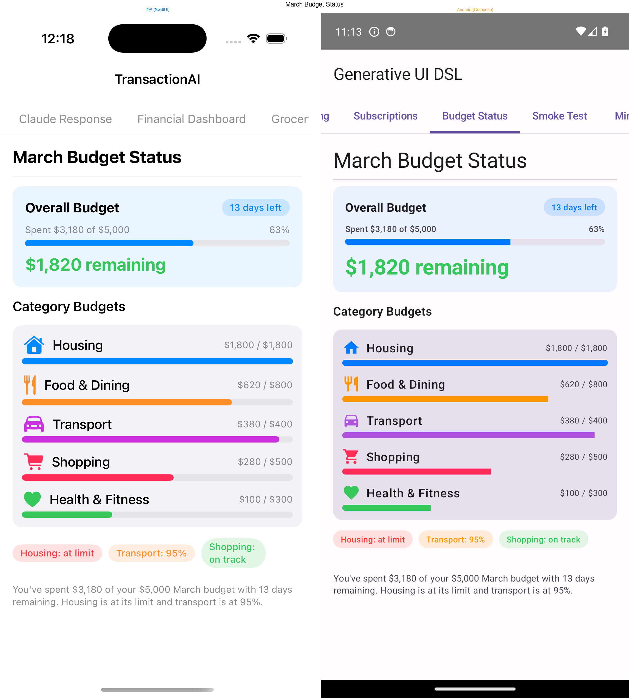

# Generative UI DSL

A cross-platform framework for rendering AI-generated native UI from JSON. Claude (or any LLM) returns a recursive layout tree — the framework walks it and renders real **SwiftUI** or **Jetpack Compose** views. No hardcoded screens.

Swift doesn't support runtime code compilation, so you can't have an LLM generate SwiftUI directly. Instead, this framework defines a **constrained DSL** — 14 node types that the LLM outputs as JSON. The constraint is the feature: it gives the LLM enough flexibility to compose creative layouts while keeping output reliable and parseable.

<p align="center">
  
</p>

## How it works

```
                    ┌──────────────────────┐
                    │  JSON Schema (spec/)  │
                    │  14 node types        │
                    │  Recursive structure  │
                    └──────────┬───────────┘
                               │
              ┌────────────────┴────────────────┐
              ▼                                 ▼
   ┌─────────────────────┐           ┌─────────────────────┐
   │  Swift Package       │           │  Kotlin Library      │
   │  UINode (enum)       │           │  UINode (sealed)     │
   │  NodeRenderer        │           │  NodeRenderer        │
   │  → SwiftUI views     │           │  → Compose views     │
   └─────────────────────┘           └─────────────────────┘
```

The LLM analyses a question, picks the right data, and returns a recursive `UINode` layout tree. The platform-specific renderer walks that tree and produces native views. Both platforms consume the **same JSON format** and produce visually equivalent output.

## Project structure

```
generative-ui/
├── Package.swift                    # Root SPM manifest (for git URL consumption)
├── spec/                            # Shared DSL contract
│   ├── generative-ui-dsl.schema.json   # JSON Schema v2020-12 (formal spec)
│   ├── icon-map.json                   # SF Symbols → Material Icons mapping
│   ├── test-fixtures/                  # 17 JSON test inputs
│   └── test-snapshots/                 # Golden render snapshots
├── packages/
│   ├── ios/                         # Swift Package — GenerativeUIDSL
│   │   ├── Sources/GenerativeUIDSL/
│   │   │   ├── UINode.swift            # Recursive enum (14 node types, Codable)
│   │   │   ├── UIResponse.swift        # Top-level response (title, layout, spoken_summary)
│   │   │   ├── NodeRenderer.swift      # Recursive SwiftUI renderer
│   │   │   └── RenderSnapshot.swift    # Tree serializer for snapshot tests
│   │   └── Tests/GenerativeUIDSLTests/
│   └── android/                     # Gradle library — com.generativeui:dsl
│       ├── src/main/kotlin/com/generativeui/dsl/
│       │   ├── model/                  # UINode sealed class + UIResponse
│       │   ├── decode/                 # kotlinx.serialization decoder
│       │   ├── render/                 # Jetpack Compose renderer + chart rendering
│       │   └── snapshot/               # Tree serializer for snapshot tests
│       └── src/test/kotlin/
├── examples/
│   └── android-sample/              # Android demo app (Jetpack Compose)
└── screenshots/                     # Cross-platform comparison images
```

## The DSL

The LLM responds with a `layout` field containing a recursive node tree:

| Category   | Types                                         |
|------------|-----------------------------------------------|
| Layout     | `vstack`, `hstack`, `zstack`                  |
| Content    | `text`, `stat`, `image`, `badge`, `progress`  |
| Container  | `card`, `list`                                |
| Data viz   | `chart` (bar, pie, line), `table`             |
| Utility    | `divider`, `spacer`                           |

Example response:

```json
{
  "title": "Food Spending",
  "layout": {
    "type": "vstack",
    "spacing": 12,
    "children": [
      { "type": "stat", "label": "Total", "value": "$214.50", "color": "orange", "icon": "fork.knife" },
      { "type": "chart", "variant": "bar", "title": "By Merchant", "data": [
        { "label": "McDonald's", "value": 54.49, "color": "red" },
        { "label": "Starbucks",  "value": 47.25, "color": "orange" }
      ]}
    ]
  },
  "spoken_summary": "You spent $214.50 on food across 18 transactions."
}
```

The formal spec is defined as a **JSON Schema v2020-12** at `spec/generative-ui-dsl.schema.json`. It enforces valid types, required fields, and recursive structure.

## Cross-platform parity

Both renderers produce structurally identical output from the same JSON. This is verified by **render snapshot tests**:

1. Each platform serializes the rendered node tree into a canonical text description using `RenderSnapshot`
2. Golden snapshots live in `spec/test-snapshots/`
3. Tests verify byte-for-byte matching across Swift and Kotlin

Icons are mapped between platforms using `spec/icon-map.json` (SF Symbols on iOS, Material Icons on Android).

<p align="center">
  
  
  
</p>

## Installation

### iOS (Swift Package Manager)

Add to your `Package.swift`:

```swift
dependencies: [
    .package(url: "https://github.com/sameergdogg/generative-ui.git", branch: "main")
]
```

Then import and use:

```swift
import GenerativeUIDSL

let response = try JSONDecoder().decode(UIResponse.self, from: jsonData)
NodeRenderer(node: response.layout)
```

### Android (Gradle)

The library is at `packages/android/`. Add it via composite build or publish to Maven:

```kotlin
// settings.gradle.kts
includeBuild("path/to/generative-ui/packages/android") {
    dependencySubstitution {
        substitute(module("com.generativeui:dsl")).using(project(":"))
    }
}

// app/build.gradle.kts
dependencies {
    implementation("com.generativeui:dsl")
}
```

Then use:

```kotlin
import com.generativeui.dsl.render.NodeRenderer

val response = Json.decodeFromString<UIResponse>(jsonString)
NodeRenderer(response.layout)
```

## Testing

```bash
# iOS
swift test

# Android
cd packages/android
gradle test
```

The test suite includes **17 test fixtures** covering:

- Basic node types (text, stat, chart, table)
- Nested layouts (deep nesting, mixed containers)
- Edge cases (all optionals missing, unknown types, malformed JSON)
- Real Claude API responses
- Complex dashboards (financial overview, grocery breakdown, subscription tracker, budget status)
- Cross-platform parity (snapshot matching between Swift and Kotlin)

## Example apps

- **[Expenses AI](https://github.com/sameergdogg/Expenses-AI)** — iOS app using Claude's tool-use API to generate expense analysis UI
- **Android sample** — `examples/android-sample/` in this repo
- **[Blog post: Building Generative UI](https://sameer.world/writing/generative-ui-deep-dive/)** — deep technical write-up of the architecture
